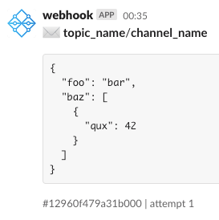

<h1 align="center">nsq_to_slack</h1>
<p align="center">Forward NSQ messages to slack</p>

<p align="center">
  <a href="https://hub.docker.com/r/iamolegga/nsq_to_slack">
    
  </a>
  <a href="https://github.com/iamolegga/nsq_to_slack/actions/workflows/on-push-main.yml?query=branch%3Amain">
    
  </a>
  <a href="https://libraries.io/github/iamolegga/nsq_to_slack">
    
  </a>
  
  
</p>

## Usage

```
$ ./nsq_to_slack --help
Usage of ./nsq_to_slack:
  -channel value
    	NSQ channel (may be given multiple times)
  -gom
    	Expose Go runtime metrics
  -log value
    	log level (debug, info, warn, error, dpanic, panic, fatal)
  -lookupd-http-address string
    	nsqlookupd HTTP address
  -nsqd-tcp-address string
    	nsqd TCP address (default "localhost:4150")
  -slack-webhook-url string
    	Slack webhook URL
  -topic value
    	NSQ topic (may be given multiple times)
```

Or in docker:

```shell
docker run --rm -p 9090:9090 iamolegga/nsq_to_slack \
  -nsqd-tcp-address=host.docker.internal:4150 \
  -topic foo -channel bar \
  -topic baz -channel qux \
  -slack-webhook-url=https://hooks.slack.com/services/...
```

Metrics are exposed at `/metrics` endpoint on :9090 port.

## Screenshot


